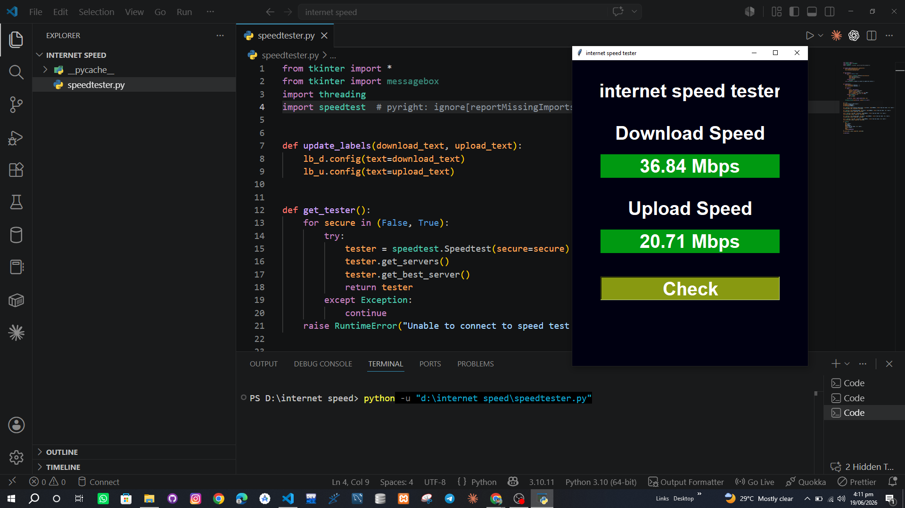

# 🌐 Internet Speed Tester

A simple and stylish Python desktop app that measures your internet download and upload speed using Tkinter and the `speedtest` library.

## ✨ Features

- ⚡ Measures download speed
- 📤 Measures upload speed
- 🖥️ Shows results in a clean GUI
- 🔄 Runs quickly with a single click

## 📸 Preview



## 🎥 Demo

Watch the demo video here: [Demo Video](video.mp4)

## ▶️ How to Run

```bash
pip install speedtest-cli
python speedtester.py
```

## 💡 Note

Make sure you have an active internet connection before running the test.
